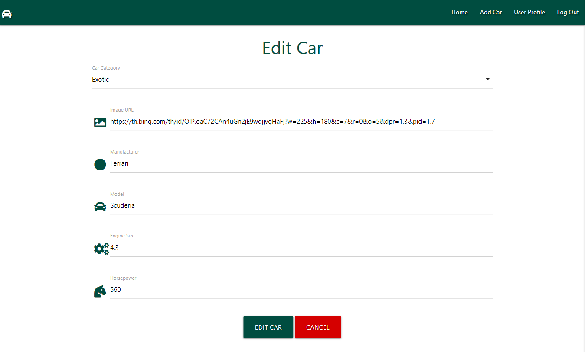

# Car Hub: Unleash your ride, join the community!

## What is Car Hub

Welcome to Car Hub, the ultimate destination for car enthusiasts! Car Hub is a platform designed for individuals passionate about their vehicles. With Car Hub, you have the power to Create, Read, Update, and Delete (CRUD) details about your beloved cars. By creating an account and engaging in user authentication, you unlock the full potential of our community. Share your automotive pride by showcasing your cars, explore the stunning rides of fellow enthusiasts, and immerse yourself in a vibrant car community. Car Hub is not just a platform; it's a haven where automotive aficionados come together to celebrate the love for cars. Join us on this exciting journey, and let's drive the passion for cars to new heights!

## Project Goals

At Car Hub, our mission is to create a dynamic and inclusive space for car enthusiasts worldwide. Our project goals revolve around fostering a vibrant community that shares, celebrates, and connects over the love of automobiles. Here are the key objectives we aim to achieve:
* Empower Car Enthusiasts: Provide users with a seamless platform to Create, Read, Update, and Delete details about their cars, empowering them to curate their automotive experiences.
* Build a Thriving Community: Cultivate a like-minded community where users can share their passion, insights, and experiences, creating meaningful connections with fellow enthusiasts.
* User Authentication and Security: Implement robust user authentication to ensure a secure and personalized experience for our community members, safeguarding their profiles and interactions.
* User-Friendly CRUD Functionality: Develop an intuitive and user-friendly interface for CRUD operations on car profiles, making it easy for users to showcase their vehicles with rich details and captivating images.
* Responsive Design: Prioritize a responsive and visually appealing design to ensure an optimal user experience across various devices, making Car Hub accessible to enthusiasts anytime, anywhere.

## User Goals

Car Hub is designed with our users in mind, aiming to provide an enriching and enjoyable experience for every car enthusiast. Here are the key user goals we strive to fulfill:

* Showcase Your Ride: Allow users to prominently display their cars by creating detailed profiles with captivating images, sharing the features that make each vehicle special.
* Discover Diverse Car Collections: Provide a platform for users to explore a wide variety of cars from different makes, models, and eras, allowing them to discover and appreciate the rich diversity within the automotive world.
* Personalized Car Management: Offer a user-friendly interface for managing their car profiles, allowing users to update details, add new cars to their collection, and easily maintain their automotive portfolio.
* Secure and Personalized Experience: Implement robust user authentication and security measures to ensure a safe and personalized experience, where users can confidently share their passion without compromising their privacy.

## Research

In regards to research I looked at several websites. The key takeaways were an easily navigated website, with the main component being how the cars are displayed.

| [Collecting Cars](https://collectingcars.com/) | [Auto Trader](https://www.autotrader.co.uk/) | [DK Engineering](https://www.dkeng.co.uk/) |

### Key Takeaways

* Intuitive and Effortless Navigation: Prioritize a user-friendly interface that allows visitors to navigate seamlessly through different sections of Car Hub, with a focus on simplicity and clarity.
* Visual Emphasis: Highlight the visual appeal of cars by incorporating high-quality images and a clear, readable section of car stats.
* Mobile Responsiveness: Ensure that Car Hub is accessible and functions smoothly across various devices, with special attention to mobile responsiveness to accommodate users on the go.

# Features

## Navigation Bar

* Site-Wide Navigation: The navigation bar maintains consistency across all pages, ensuring easy access to key sections throughout the entire site.
* Navigation: For non-logged-in users, access is limited to the home page, login, and registration pages.
Once logged in, users gain additional access to features such as adding a car, managing their personal profile, and the option to log out.
* Placement/Responsive: The navigation bar is strategically positioned at the top of the page, maximizing visibility. On smaller screen sizes, it transforms into a collapsible navbar, as depicted in the image three:

### Small screen sizes

## The Hub (home page)

* The Hub: This is where the users cars are showcased. Images, car stats and the user who added the car are all visible here.
* Cards: The information is stored in cards with an emphasis on user images to promote their rides. This is the first page users are greeted with.

## Add Car Form

* The Add Car Form is thoughtfully organized, guiding users through a systematic order to effortlessly input all relevant information about their vehicles.
* Required fields must be filled in, and the form employs dynamic validation. Incomplete fields are highlighted in red, guiding users to provide necessary information. As each field is successfully filled, it transforms to a reassuring green.
* To ensure accuracy, only specific keys and numerical values are allowed in certain fields. This prevents input errors and streamlines the data entry process.
* The form provides real-time feedback, alerting users about incomplete or incorrectly formatted entries. This user-friendly approach enhances the overall experience, making the form intuitive and responsive.
* After successfully adding a car, users are seamlessly redirected to the home page. A flash message promptly appears, confirming the successful addition of the car. 

### Flash Message

## Edit Car Form

* The Edit Car Form intuitively displays the existing data of the selected car, allowing users to view and modify specific details.
* Users have the flexibility to update any of the data inputs within the form. This feature is valuable for correcting errors, updating images, or refining statistical information.
* A "Cancel" option is provided, directing users back to their profile without making any changes. This feature ensures a hassle-free experience for users who decide not to edit the car's information.
* Upon clicking the "Edit Car" button, changes to the information are processed, and users receive instant confirmation through a flash message. 

### Flash Message

## User Profile

* The User Profile page prominently showcases the user's display name. Thus creating a personalized and welcoming experience.
* This dedicated space is reserved solely for the current session user's vehicles. No other vehicles are displayed, ensuring a focused and private view of their automotive collection.
* Users enjoy the convenience of managing their vehicles directly from the User Profile page. Edit and Delete buttons are readily accessible, allowing for seamless updates and removals.

## Log In and Register Pages

* Both the Log In and Register pages share the same user-friendly form, streamlining the user experience and ensuring consistency across actions.
* The form prompts users to input a username and password for authentication. Whether logging in or registering, this central form serves as the gateway to access Car Hub's features.
* Upon logging in the user is directed to their profile where a welcome message greets them.
* To enhance registration the user is flashed a "registration successful" message. Once registered they are immediately logged in and able to create, read, update and delete their personal records.
* Enhancing user convenience, the password field includes an eye icon, allowing users to toggle visibility and view the inputted password. This feature ensures accuracy during the registration process and ease of use during login.

### Log In

### Flash Message

### Register

### Flash Message

### Password Visibility

## Delete car modal

* Users encounter a step within the modal that prompts them to confirm the deletion action. This intentional pause allows users to reconsider their choice and mitigates the risk of unintentional data loss.
* The modal features a red "Delete" button and a teal "Cancel" button. The color scheme aligns with the visual language of the application, maintaining consistency with other buttons and enhancing the overall user experience.

## User Stories

## User Story Testing

| **Feature** | **Expect** | **Action/Result** | 
| -------- | -------- | -------- |
|  |  |  |

Screen Recording

## Future Features

Additional features I plan to include are:
* Like feature on the home page.
* Comment feature on home page.

# Design and Structure

## Structure

The site is made up of eight pages.
* Base.html: contains the html boiler plate which was used to extend onto the other pages. It contains the navigation bar and all the neccesary files to run the website.
* Stats.html: is the main/home page. This is where all the user inputs are displayed in a uniform manor.
* Profile.html: contains the same information as stats.html with the addition of the update and delete functions, which are prompted via the click of buttons.
* edit_car and add_car.html: both contain the same form where the user can add information about their vehicles or update once added.
* login and register.html: both pages have the same format and allow the user to register and login and logout once the user has created an account.
* 404.html: is a page the user is directed to if they enter an incorrect url and it allows them to return to the home page via a "Click here" prompt.

### Colors

* Teal:  In the context of Car Hub, teal serves as the primary color, reflecting a premium and elegant feel for car enthusiasts. The use of teal throughout the site aims to evoke a sense of luxury and excellence, enhancing the overall visual appeal.
* White: In Car Hub, white is strategically incorporated within teal elements to provide a clean appearance. This combination enhances readability.
* Red: In the context of Car Hub, red is specifically used for actions related to the deletion of files. This bold color choice serves to signify the irreversible nature of file deletion, acting as a visual cue to users that this action should be approached with caution.

### Languages Used

* [HTML](https://www.w3schools.com/html/html_intro.asp) Why I Used It: HTML serves as the foundation for structuring my web pages.
* [CSS](https://www.w3schools.com/Css/) Why I Used It: CSS allows me to style and format the visual presentation of HTML elements.
* [Javascript/Jquery](https://jquery.com/) Why I Used It: JavaScript is my go-to language for creating dynamic and interactive features on my web pages. Such as the modal and to initialize materialize.
* [Jinja2](https://jinja.palletsprojects.com/en/2.10.x/) Why I Used It: Jinja, integrated with my Python web framework (Flask), serves as a templating engine.
* [Python](https://www.python.org/) Why I Used It: Python, being a versatile and high-level programming language, is my backend powerhouse. It works in tandem with my web framework to handle server-side logic, manage routes, interact with databases, and coordinate the overall functionality of Car Hub.

### Tools

* [Git](https://git-scm.com/)
Used for version control via GitPod by using the terminal to Git and Push to GitHub.
* [GitHub](https://github.com/)
Used to store the project code after being created in GitPod / Git.
* [Gitpod](https://www.gitpod.io/)
Used to create, edit & preview the project's code.
* [MongoDB](https://www.mongodb.com/)
Used to create the collection which holds information on a non-relational database about users, stats and categories.
* [Heroku](https://www.heroku.com/)
Used to deploy the finished website.

# Testing

## HTML Validation

## CSS Validation

## Javascript Validation

## Python Validation

## Responsiveness

The site was tested on the following devices:
* Asus Vivobook Book Pro 16"
* Samsung S23 Ultra
* Samsung S20
* Acer Chromebook 14"
* Google Developer tools. Utilizing all dimensions including the responsive option.

## Deployment

### Step by step guide to deploying to Heroku
* Firstly I had to create a Heroku account.
* 

## Credits